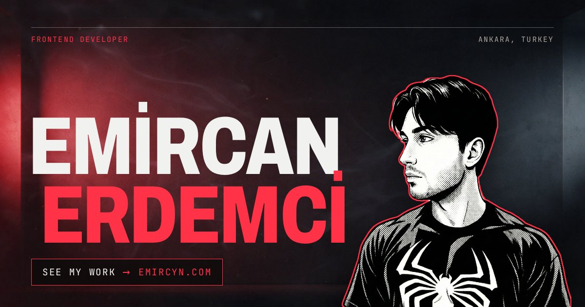

<a href="https://emircyn.com"></a>

# Hi, I’m Emircan

I’m a frontend developer in Ankara, working at [InspireIT](https://inspireit.com.tr/). I build the part of the web people actually touch: websites and web apps that load fast, hold up on every screen, and move only when the motion explains something.

**[emircyn.com](https://emircyn.com)** · [LinkedIn](https://www.linkedin.com/in/emircyn/) · [emircan.erdemci@hotmail.com](mailto:emircan.erdemci@hotmail.com) · [Türkçe](https://emircyn.com/tr/)

## What I do

- **Interfaces.** From a marketing site to an admin panel, I turn a design into pages that work on every screen size.
- **Improvements.** I measure first, fix the part that is actually slow, then measure again.
- **Motion.** Scroll animations and small interactions that explain something, and still read with motion turned off.

React · Next.js · Vue · Nuxt · Astro · TypeScript · Tailwind CSS · GSAP · Supabase · Stripe · Cloudflare Workers

## Recent work

| Project | What it is | Built with |
|---|---|---|
| **[Porch](https://github.com/Emircyn/porch)** · [live](https://porch.emircan-erdemci.workers.dev) · [demo](https://porch.emircan-erdemci.workers.dev/demo) | A link-in-bio page builder, from idea to working product: a drag-and-drop editor with a live phone preview, 11 themes with dark mode, click analytics and Stripe subscriptions. Plan limits are enforced by the database. | Next.js 16, Supabase, Stripe, shadcn/ui, Cloudflare Workers |
| **[Parley](https://github.com/Emircyn/parley)** · [live](https://parley.emircan-erdemci.workers.dev) | An AI chat that answers with more than text: ask for the weather and a forecast card appears, ask for a sum and you get the exact number. Runs entirely on Cloudflare’s free tier. | Nuxt 4, Nuxt UI, AI SDK, Workers AI |
| **[InspireIT](https://inspireit.com.tr/)** | The bilingual website of the company I work for, an IT firm serving enterprises since 2003. | WordPress, Elementor, custom theme and plugins |
| **[emircyn.com](https://emircyn.com)** · this repo | My personal site, described below. | Astro, GSAP, Lenis, Cloudflare Workers |

The next one is on the workbench.

---

## About this repository

This is the source of [emircyn.com](https://emircyn.com), in English and Turkish. The page is built as a scroll-driven film: five acts on a dark ground with one hard cut to paper, and a crimson thread down the left edge that is drawn by scroll and doubles as navigation.

| # | Act | What happens |
|---|---|---|
| 1 | Hero | Four planes (room, name, alpha-cut figure, haze) driven by scroll, pointer and an idle loop |
| 2 | Work | The three services hold still in a column while the projects pass beside them, and the services each project used light up. Each project is a browser frame clipped open from the thread’s side with a phone riding over it |
| 3 | Measure | A dial clip scrubbed by the wheel; the readout steps through real Lighthouse scores |
| 4 | Record | Hard cut to paper, reveals only, deliberately still |
| 5 | Contact | Pointer-lit close with a magnetic mail link |

Every act has a complete static composition. With `prefers-reduced-motion` or without JavaScript, the page still reads top to bottom, and the scroll engine is only loaded after the first paint.

**Lighthouse performance:** 100 on desktop, 91 on a throttled phone (median of three runs, September 2026).

### Stack

- [Astro 5](https://astro.build/), static output, no client framework
- [Tailwind CSS 4](https://tailwindcss.com/) for the tokens, component styles scoped in `.astro` files
- [GSAP ScrollTrigger](https://gsap.com/docs/v3/Plugins/ScrollTrigger/) for pinned and scrubbed timelines
- [Lenis](https://github.com/darkroomengineering/lenis) for wheel smoothing (touch stays native)
- Archivo Variable and JetBrains Mono, self-hosted through Fontsource
- A Cloudflare Worker with static assets, which also folds `http://` and `www.` into one canonical host

### Run it locally

```bash
npm install        # or: bun install
npm run dev        # http://localhost:4321
npm run build      # static output in dist/
npx wrangler dev   # the built site behind the Worker, as in production
```

Pushes to `master` build and deploy through Cloudflare Workers Builds. Preview URLs are off; review a build locally with `npx wrangler dev`.

### Layout

```
src/
├── assets/         # hero plates, portrait, dial poster, project screenshots
├── components/     # one file per act, plus SEO, header, thread
├── i18n/           # en.json, tr.json and the t() helper
├── layouts/        # Layout.astro loads the scroll engine after first paint
├── pages/          # /en/, /tr/, robots.txt, and a local-only language gate
├── scripts/        # scroll.ts (acts, ambient loop, thread), scrub.ts (dial)
└── styles/         # global.css: tokens, grounds, grain, ticker
public/
├── media/          # dial clips encoded for scrubbing
├── _headers        # edge caching and security headers
└── _redirects      # / → /en/
worker/index.js     # canonical host redirect, noindex on preview URLs
```

### License

The code is [MIT](LICENSE). The portrait, photographs, project screenshots and the site’s copy are mine and are not covered by that license; please don’t reuse them.
